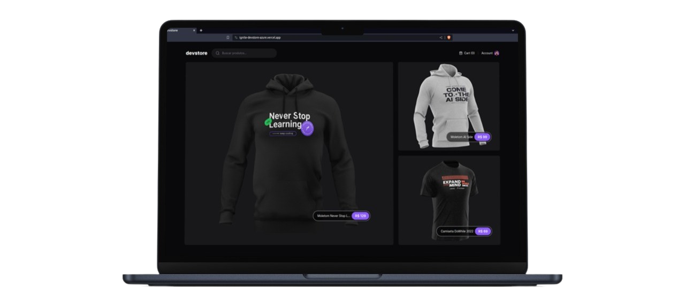

<div align="center">
    
</div>

# devstore

Aplicação para venda de camisetas e moletons dos eventos da Rockeseat.
O projeto está hospedado na Vercel e você pode conferir clicando [aqui](https://ignite-devstore-azure.vercel.app/). ⚡ 

## Tecnologias
- Next.js
- TypeScript
- Cypress

## Aprendizados importantes

### Utilização do Next.js em sua versão mais recente.
- Nova estrutura do Nexts.js utilizando "app folder";
- Server components;
- Cache e Memoization;

### Testes E2E com Cypress;
- Comandos personalizados (Cypress);
- Workflow de CI com Cypress;

## Configuração Local

### Clone o repositório:
```bash
$ git clone https://github.com/ecthon/ignite-devstore.git
```

### Instale as dependências:
```bash
$ cd devstore
$ npm install
```

### Inicie o servidor de desenvolvimento:
```bash
$ npm run dev
```

## Devstore API
Endpoint dos produtos: https://ignite-devstore-api-products.vercel.app/api/products </br>
Repositório da API: https://github.com/ecthon/ignite-devstore-api-products

## Desenvolvido
Desenvolvido por [@ecthon](https://www.linkedin.com/in/ecthon/).